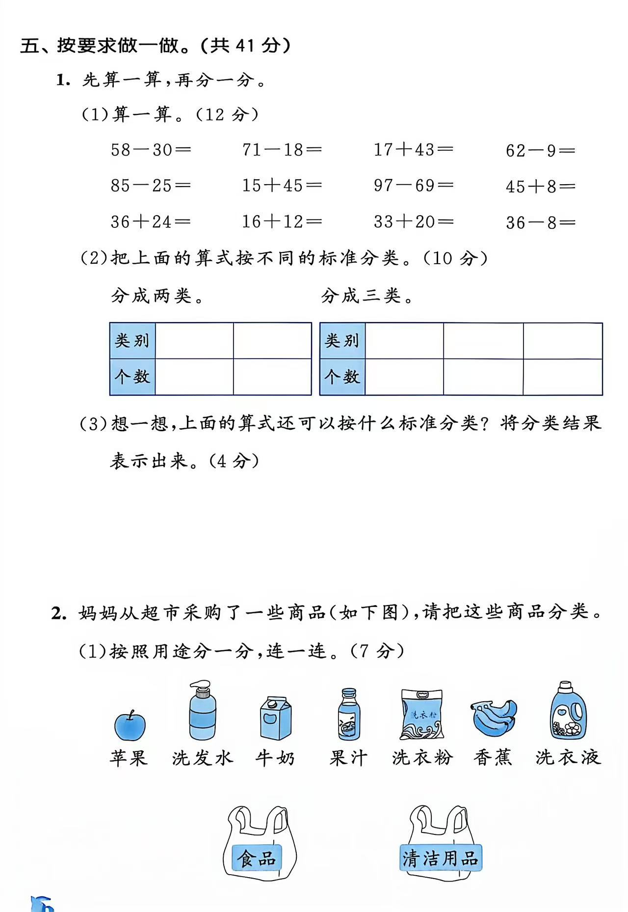

# 纸净（Paperlight）

纸净是一款轻量、离线的 Windows 文档扫描工具。它能把手机或相机拍摄的纸张照片进行裁剪、透视校正、书页展平和画面增强，并直接导出或打印扫描件。

图片处理全部在本机完成，不上传服务器。

## 效果对比

| 处理前：手机拍摄原图 | 处理后：展平与高清增强 |
| --- | --- |
|  |  |

处理过程会校正拍摄透视和书页弯曲，减弱阴影与背面透字，并将纸张背景净化为接近扫描仪的白色，同时保留文字、表格和彩图细节。

## 功能

- 拖入图片或通过文件选择器打开 JPG、PNG、WebP
- 裁剪框默认贴合整张图片，并提供 `1/3`、`1/2`、`全图` 快捷尺寸
- OpenCV 自动识别纸张边界，四个控制点可手动拖动校正
- 四点透视校正，将倾斜拍摄的纸张转成正视图
- 基于文字横向笔画走势的非线性书页展平
- 彩色高清、灰度、黑白、仅校正四种扫描模式
- 背景净化、对比度、锐化和展平强度调节
- 结果预览支持鼠标滚轮缩放、按住拖动、双击复位
- 导出高质量 JPG 或 PNG
- 检测 Windows 已安装的本地及共享/局域网打印机，生成结果后可直接打开打印对话框
- 完全离线处理，无账号、无云端依赖

## 技术栈

| 部分 | 技术 | 用途 |
| --- | --- | --- |
| 桌面框架 | Tauri 2 | Windows 窗口、原生能力和 NSIS 安装包 |
| 前端 | TypeScript、HTML、CSS、Vite 7 | 界面与交互 |
| 图像引擎 | OpenCV.js 5 + WebAssembly | 边界识别、透视变换、曲面重映射和图像增强 |
| 原生层 | Rust | Tauri 启动、文件能力和 Windows 打印机枚举 |
| Windows API | `EnumPrintersW` | 读取系统已安装和已连接的打印机 |
| 包管理 | pnpm、Cargo | JavaScript 与 Rust 依赖管理 |

OpenCV 以 WASM 形式随应用打包，不需要另外安装大型 OpenCV DLL。Windows 安装包约数 MB；实际大小会随功能和依赖变化。

## 使用方法

1. 打开或拖入一张文档照片。
2. 默认裁剪框贴满图片；也可以点击 `1/3`、`1/2`，或使用“重新识别边界”。
3. 拖动四个绿色圆点，使边框贴合纸张。
4. 切换到“查看效果”，选择扫描模式并调整参数。
5. 使用鼠标滚轮放大；放大后按住图片拖动；双击恢复完整视图。
6. 导出 JPG/PNG。系统存在打印机时，也可以直接点击“打印”。

“书页展平”适合拍摄书本时出现的自然弯曲。平整纸张可将该参数调低或设为 `0`。

## 开发环境

- Windows 10/11
- Node.js 与 pnpm
- Rust stable（MSVC 工具链）
- Visual Studio 2022 Build Tools，包含“使用 C++ 的桌面开发”组件
- WebView2 Runtime（Windows 11 通常已包含）

安装依赖并启动开发版：

```powershell
pnpm install
pnpm tauri dev
```

只调试浏览器前端：

```powershell
pnpm dev
```

## 构建 Windows 安装包

最简单的方式是双击项目根目录的 `打包.bat`。脚本会检查 Node.js、pnpm、Rust 和 Visual Studio C++ Build Tools，然后生成 NSIS 安装包。

已经安装过依赖时，也可以运行：

```powershell
.\build-windows.ps1 -SkipInstall
```

安装包输出到：

```text
src-tauri/target/release/bundle/nsis/
```

也可以使用标准 Tauri 命令：

```powershell
pnpm tauri build
```

## 项目结构

```text
src/
  main.ts          界面、裁剪、预览、导出和打印交互
  scanner.ts       OpenCV 图像识别、透视校正、展平与增强
  styles.css       应用界面及打印样式
src-tauri/
  src/lib.rs       Tauri 原生入口和打印机枚举
  tauri.conf.json  窗口、安全策略和打包配置
public/samples/    内置示例图片
build-windows.ps1  Windows 打包脚本
打包.bat           双击打包入口
```

## 隐私与限制

- 图片不会离开当前设备。
- 打印机检测仅枚举已经安装到 Windows 或已经建立连接的共享打印机，不会主动扫描整个局域网的未知设备。
- 书页展平属于本地启发式算法，严重遮挡、双页跨页、极端弯曲或没有文字横线的图片可能仍需手动调整。

## License

当前仓库尚未添加开源许可证。若准备公开发布，请在提交前补充合适的 `LICENSE` 文件。
